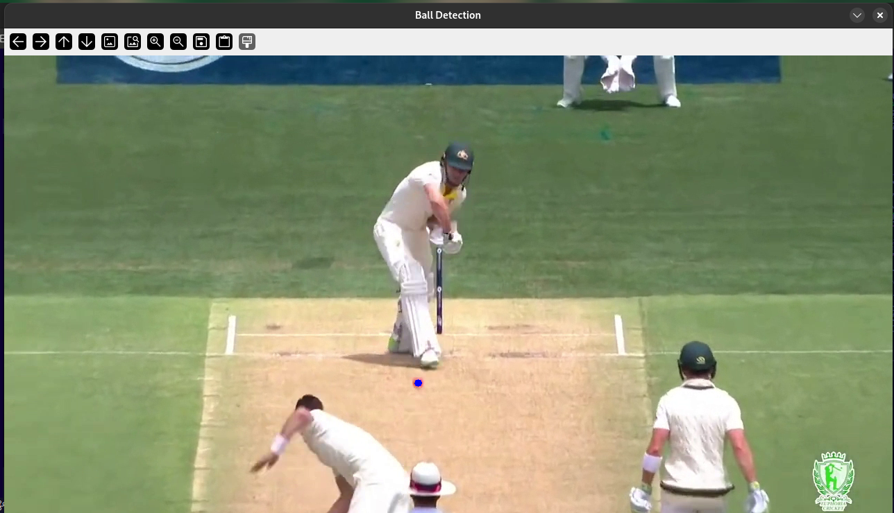
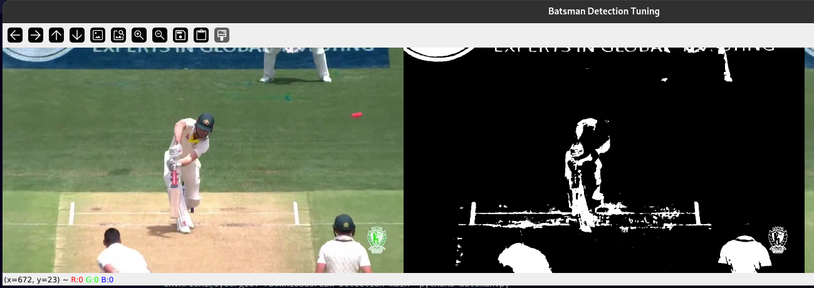
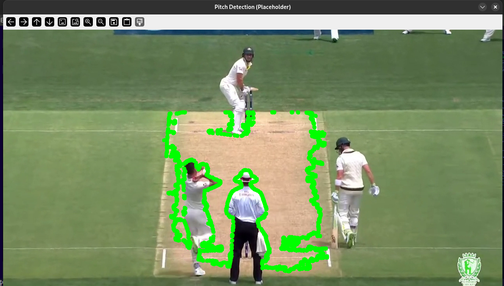
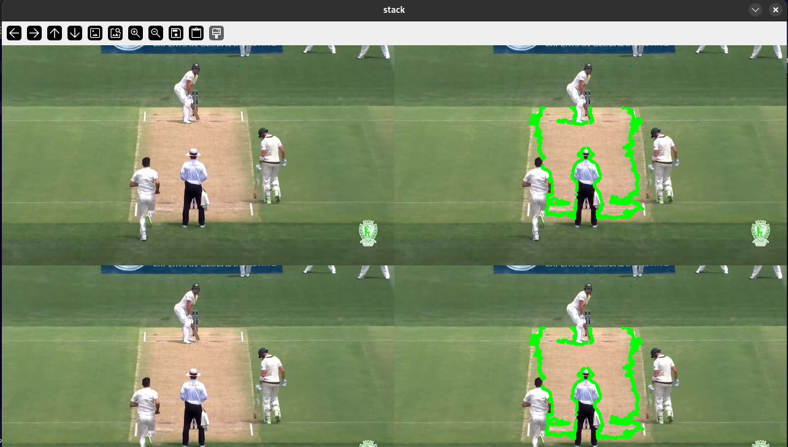
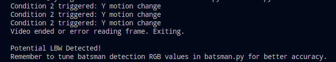

# LBW Detection in Cricket: A Deep Dive with OpenCV & NumPy

## Overview

This project is a Python-based system for detecting Leg Before Wicket (LBW) scenarios in cricket videos. It utilizes computer vision techniques with OpenCV and the cvzone library to identify key elements in a cricket video feed: the ball, the batsman, and the pitch. By analyzing the motion and position of the ball relative to the batsman and the pitch, the system attempts to predict potential LBW situations.

> **Note**: This project provides a basic implementation for LBW detection based on a simplified set of rules. Accuracy may vary depending on video quality, camera angle, and lighting conditions. Further refinement and more sophisticated LBW rule implementation are areas for future development.

## Features

- **Ball Detection**: Color-based ball detection using HSV color filtering and contour analysis to locate the cricket ball in video frames.
- **Batsman Detection**: RGB color-based batsman detection combined with edge detection techniques to identify the batsman. Tunable RGB color range and Canny thresholds for optimized detection.
- **Pitch Detection**: Basic contour-based pitch detection.
- **Basic LBW Detection Logic**: Implements a simplified `ball_pitch_pad` function to classify ball motion and detect potential "Pad" before wicket scenarios.
- **Real-time Video Processing**: Processes cricket videos frame-by-frame to detect objects and analyze ball motion.
- **Visualization**: Displays processed video frames with contours drawn around detected objects (ball, pitch, batsman) and stacks images for visual output.
- **Parameter Tuning**: Includes trackbars in `batsman.py` to tune RGB color range and Canny thresholds for batsman detection, enabling optimization for different video conditions.
- **LBW Potential Output**: Prints "Potential LBW Detected!" or "No LBW Detected" in the console at the end of video processing based on the "Pad" condition.


### Installation

#### Prerequisites

* Python 3.7 or higher
* OpenCV (cv2): `pip install opencv-python`
* cvzone: `pip install cvzone`
* NumPy: `pip install numpy`

### Setup Instructions

1.  **Clone the repository:**

    ```bash
    git clone https://github.com/docsallover/lbw-detection-in-cricket.git
    cd lbw-detection-in-cricket/
    ```

2.  **Create a virtual environment (recommended):**

    ```bash
    python -m venv venv
    source venv/bin/activate  # On Linux/macOS
    venv\Scripts\activate  # On Windows
    ```

3.  **Install dependencies:**

    ```bash
    pip install -r requirements.txt # Create a requirements.txt if needed, or install manually as listed in Prerequisites
    ```

    
4.  **Place your video:** Place your cricket video file (e.g., `lbw.mp4`) in the main project directory. If you use a different video file or location, you will need to update the video path in `main.py` and the testing blocks of other files.


## Usage

### 1\. Tune Batsman Detection Parameters

Before running the main LBW detection, it is crucial to tune the RGB color range and optionally Canny thresholds for batsman detection to achieve optimal results for your specific video conditions.

1.  Run the `batsman.py` script:

    ```bash
    python batsman.py
    ```

2.  A window named "Trackbars" and "Batsman Detection Tuning" will open, displaying a stacked image showing the original frame, the color mask, and the frame with detected batsman contours.

3.  Adjust the trackbars in the "Trackbars" window to optimize batsman detection:

      * **RGB Color Range Trackbars ("R Min", "G Min", "B Min", "R Max", "G Max", "B Max"):** Tune these to isolate the batsman in the color mask (middle image in the stack). Aim to make the mask highlight the batsman as cleanly as possible while minimizing background noise.
      * **Canny Threshold Trackbars ("Canny Thresh 1", "Canny Thresh 2"):** Optionally adjust these Canny edge detection thresholds if you want to refine the batsman contours further.

4.  Press the `s` key once you are satisfied with the tuning. The tuned RGB color range and Canny threshold values will be printed in your console.

5.  **Copy the Tuned Values.** Note down or copy the printed `Saved RGB lower`, `Saved RGB upper`, `Saved Canny Threshold 1`, and `Saved Canny Threshold 2` values.

### 2\. Update `main.py` with Tuned Values

1.  Open the `main.py` file in a text editor.

2.  Locate the following lines in the `main.py` script:

    ```python
    # Define TUNED RGB color range for batsman detection - REPLACE these with your TUNED values from batsman.py trackbars!
    tuned_rgb_lower = np.array([112, 0, 181]) # Example - REPLACE with your tuned lower RGB value
    tuned_rgb_upper = np.array([255, 255, 255]) # Example - REPLACE with your tuned upper RGB value

    # Optional: Tuned Canny thresholds for batsman detection - REPLACE if you tuned these in batsman.py
    tuned_canny_threshold1 = 100 # Example - REPLACE if you tuned Canny threshold 1
    tuned_canny_threshold2 = 200 # Example - REPLACE if you tuned Canny threshold 2
    ```

3.  **Replace the example placeholder values** with the **tuned values** you obtained from running `batsman.py` and pressing `s`. For example, if `batsman.py` printed `Saved RGB lower: [50 20 150]`, you would update `tuned_rgb_lower = np.array([50, 20, 150])`.

### 3\. Run LBW Detection

1.  Run the `main.py` script:

    ```bash
    python main.py
    ```

2.  The script will process the video (`lbw.mp4` by default) frame by frame, displaying a stacked output showing ball, pitch, and batsman detection.

3.  **Keyboard Controls during video processing:**

      * Press `k`: Pause or resume video processing.
      * Press `q`: Quit the application.

4.  After the video processing is complete, the script will print either "Potential LBW Detected\!" or "No LBW Detected (based on Pad condition)." in the console, indicating the overall LBW detection result based on the "Pad" condition analysis throughout the video.

## Project Structure

```
LBW-Detection-main/
├── main.py          # Main script to run LBW detection, integrates all modules
├── ball_detect.py    # Module for ball detection using color-based segmentation
├── batsman.py      # Module for batsman detection using color and edge detection, includes tuning trackbars
├── pitch.py         # Module for pitch detection using basic contour detection
├── lbw.mp4      # Example cricket video file (replace with your video)
├── requirements.txt # (Optional) List of Python dependencies
└── README.md        # This README file
```

  * **`main.py`**: The primary script that orchestrates the entire LBW detection process. It reads video frames, calls detection functions from `ball_detect.py`, `batsman.py`, and `pitch.py`, implements the `ball_pitch_pad` logic, and displays the results.
  * **`ball_detect.py`**: Contains the `ball_detect` function responsible for detecting the cricket ball in each frame using color-based segmentation and contour detection.
  * **`batsman.py`**: Contains the `batsman_detect` function for batsman detection using RGB color filtering and edge detection. It also includes trackbar functionality for parameter tuning.
  * **`pitch.py`**: Contains the `pitch` function responsible for detecting the cricket pitch in each frame using basic contour detection.
  * **`lbw.mp4`**: Example video file. Replace this with your own cricket video.
  * **`requirements.txt`**: (Optional) Lists the Python package dependencies for the project.

## Screenshots

### Ball Detection


### Batsman Detection
   

### Pitch Detection


### Ball + Batsman + Pitch - main.py


### Terminal/Console Output



## License
This project is licensed under the MIT License. See the LICENSE file for more details.


## Visit and Follow
For more details and tutorials, visit the website: [DocsAllOver](https://docsallover.com/).

Follow us on:
- [Facebook](https://www.facebook.com/docsallover)
- [Instagram](https://www.instagram.com/docsallover.tech/)
- [X.com](https://www.x.com/docsallover/)
- [LinkedIn](https://www.linkedin.com/company/docsallover/)
- [YouTube](https://www.youtube.com/@docsallover)
- [Threads.net](https://threads.net/docsallover.tech)

and visit our website to know more about our tutorials and blogs.
